<div align="center">

# 🦫 Bryqo

**Aprenda a pensar como programador — um conceito por vez.**

Um app iOS nativo, no estilo Duolingo, para ensinar os **fundamentos da ciência da computação** (lógica, algoritmos, estruturas de dados, Big O, redes e mais) através de micro-lições gamificadas, em português.

<br/>


</div>

---

## 📑 Índice

- [Sobre o projeto](#-sobre-o-projeto)
- [Screenshots](#-screenshots)
- [Funcionalidades](#-funcionalidades)
- [Tecnologias](#-tecnologias)
- [Arquitetura](#-arquitetura)
- [Design System](#-design-system)
- [Persistência & sincronização](#-persistência--sincronização)
- [Gamificação](#-gamificação)
- [Acessibilidade](#-acessibilidade)
- [Testes](#-testes)
- [Estrutura de pastas](#-estrutura-de-pastas)
- [Como rodar](#-como-rodar)
- [Roadmap](#-roadmap)
- [Autoria](#-autoria)

---

## 🎯 Sobre o projeto

**Bryqo** é um aplicativo de aprendizado mobile construído 100% de forma nativa para o ecossistema Apple. A proposta é ensinar **fundamentos antes de frameworks**: em vez de decorar sintaxe, o usuário constrói uma base sólida de raciocínio computacional, guiado pelo mascote **Brix** através de um "vale" que se completa conforme as lições avançam.

O conteúdo está organizado em **12 unidades** e **41 lições** que cobrem desde lógica de programação até arquitetura de computadores, cada uma dividida em passos curtos: história → conceito → exercício → resumo.

| | |
|---|---|
| **Plataforma** | iOS 26.5+ (iPhone) |
| **Linguagem** | Swift (modo de linguagem 5) com concorrência moderna |
| **UI** | SwiftUI declarativo, sem Storyboards |
| **Conteúdo** | 12 unidades · 41 lições · pt-BR |
| **Código** | ~6.7k linhas de Swift |

---

## 📸 Screenshots

O app suporta **light mode** e **dark mode** de forma nativa e adaptativa, controlados por um toggle no perfil.

### Trilha de aprendizado & lições

| Aprender (Light) | Aprender (Dark) |
|:---:|:---:|
| 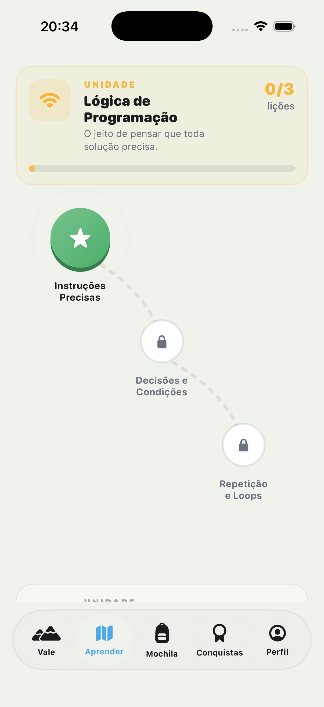 | 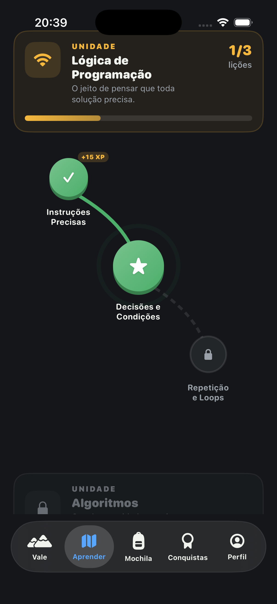 |

| Exercício (Light) | Exercício (Dark) |
|:---:|:---:|
| 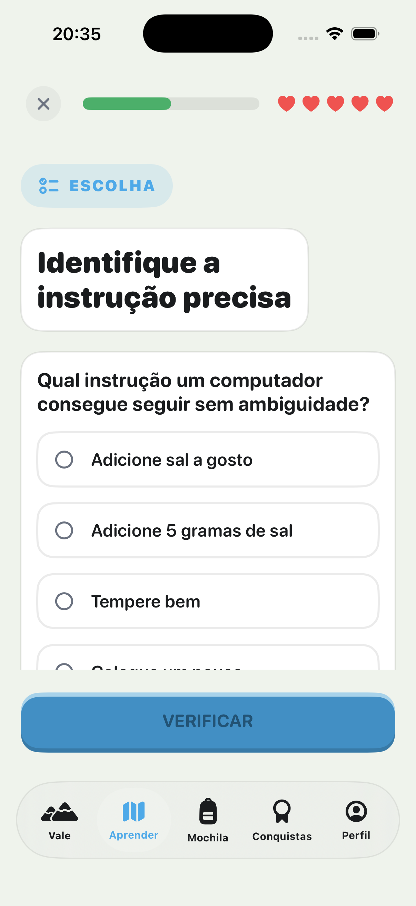 | 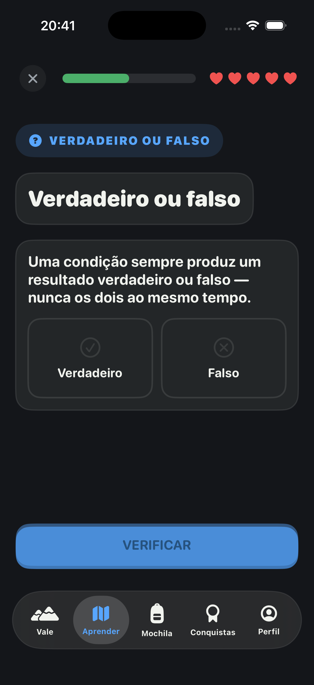 |

| Lição concluída (Light) | Lição concluída (Dark) |
|:---:|:---:|
| 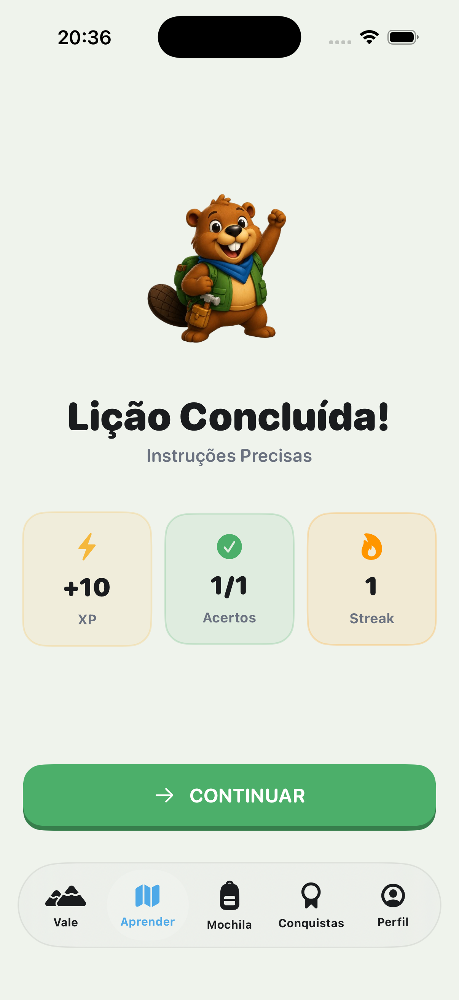 | 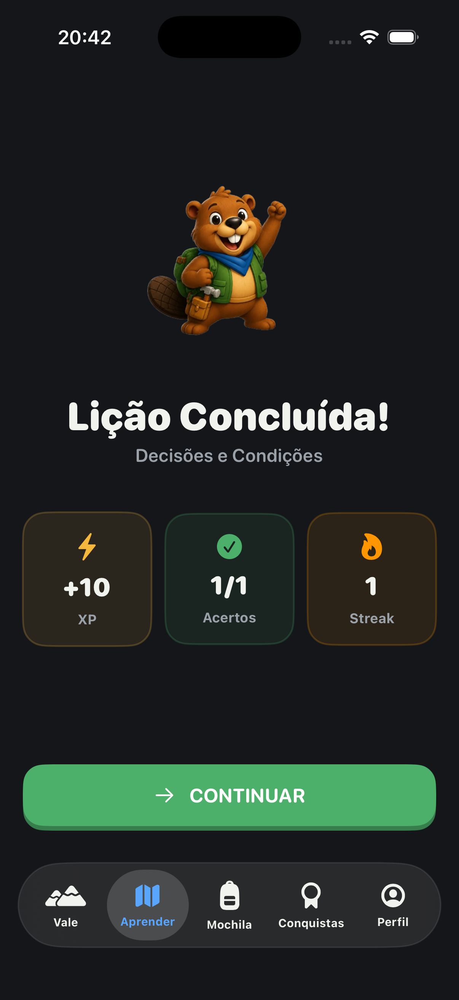 |

### Progresso & perfil

| Conquistas (Light) | Conquistas (Dark) |
|:---:|:---:|
| 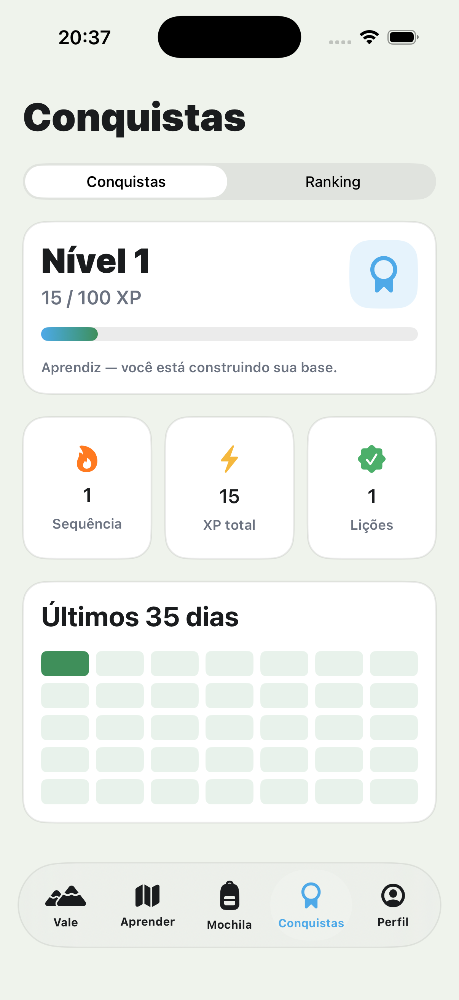 | 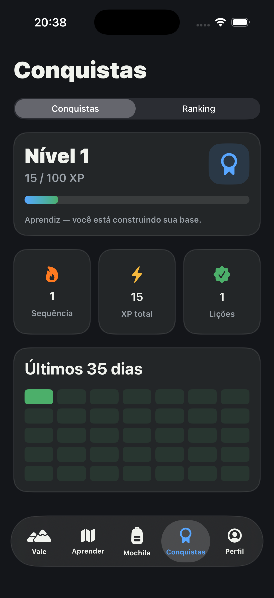 |

| Perfil (Light) | Perfil (Dark) |
|:---:|:---:|
| 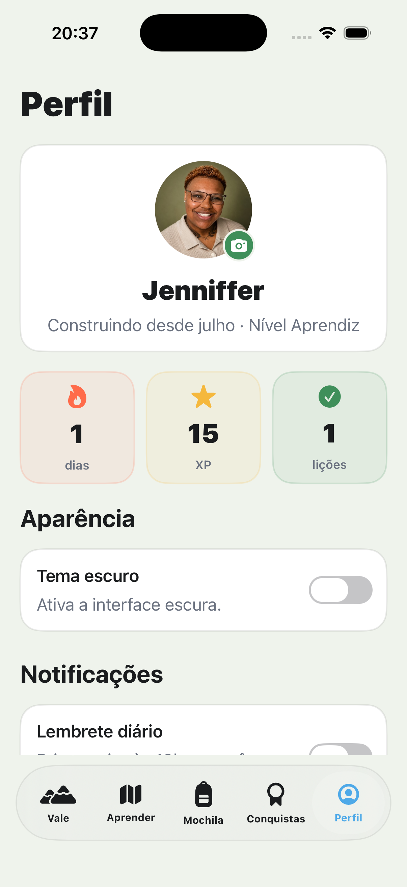 | 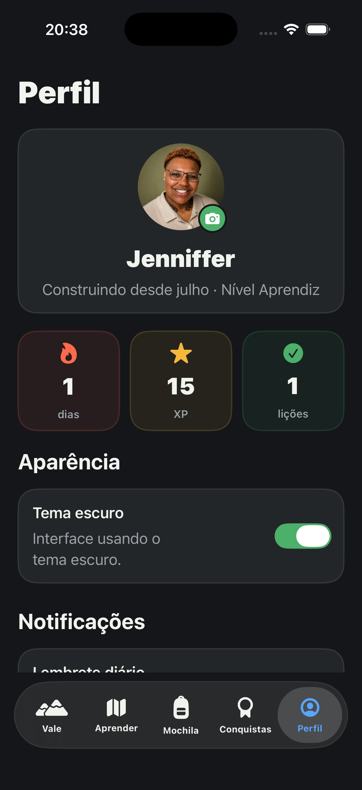 |

### Onboarding & feedback

| Boas-vindas | Contexto da lição | Feedback de acerto |
|:---:|:---:|:---:|
| 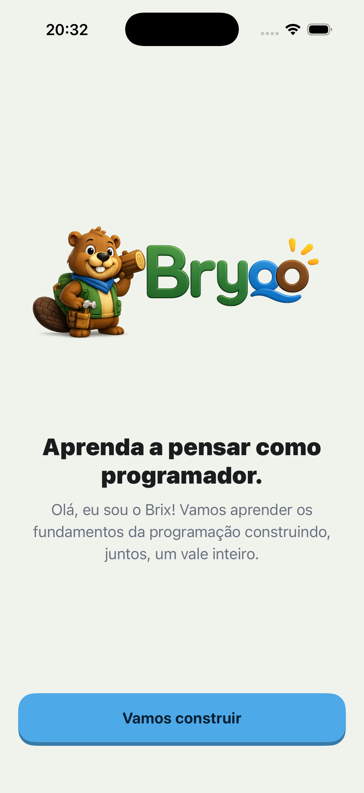 | 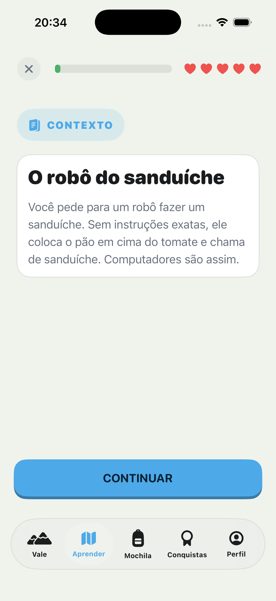 | 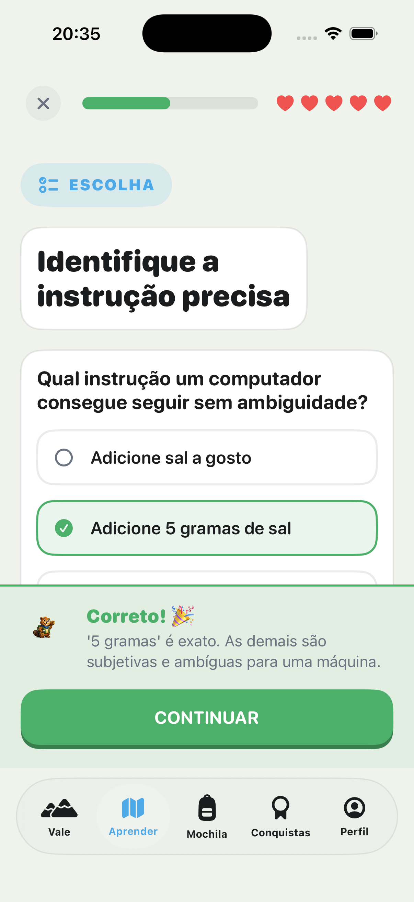 |

---

## ✨ Funcionalidades

- 🗺️ **Trilha de aprendizado** estilo mapa, com lições que desbloqueiam em sequência.
- 📚 **Lições multi-passo**: história, conceito, escolha única, verdadeiro/falso, ordenação e complete-o-código.
- 🎮 **Gamificação completa**: XP, níveis, corações (vidas), sequência (streak), conquistas e materiais colecionáveis.
- 🔥 **Proteção de sequência** (streak freeze) e **regeneração de corações** ao longo do tempo.
- 🎯 **Meta diária** configurável por perfil (Casual · Regular · Sério · Intenso).
- 🏔️ **Vale do progresso** — uma cena viva que evolui com o avanço do usuário.
- 🎒 **Mochila** de materiais e **Conquistas** com ranking.
- 👤 **Onboarding** conversacional em 7 passos com o mascote Brix.
- ☁️ **Sincronização em nuvem** com login anônimo + **Sign in with Apple**.
- 🔔 **Lembrete diário** local para manter o hábito.
- 🌗 **Light / Dark mode** e **acessibilidade** completa (Dynamic Type, VoiceOver, Reduce Motion, háptica).

---

## 🛠 Tecnologias

| Camada | Tecnologia |
|---|---|
| **Linguagem** | Swift (modo 5) · concorrência estruturada (`async/await`, `Task`, `@MainActor`) |
| **Interface** | SwiftUI (100% declarativo) |
| **Estado** | Observation framework (`@Observable`) |
| **Persistência local** | **SwiftData** (`@Model`, `ModelContainer`) com migração de schema versionada (V1→V4) |
| **Backend / nuvem** | **Firebase** — Auth, Firestore, Analytics, Crashlytics |
| **Autenticação** | Firebase Auth anônimo + **Sign in with Apple** (`AuthenticationServices` + `CryptoKit`) |
| **Notificações** | `UserNotifications` (lembrete diário local) |
| **Gerência de pacotes** | Swift Package Manager (`firebase-ios-sdk`) |
| **Testes** | **Swift Testing** (`@Test`, `@Suite`) |

---

## 🏗 Arquitetura

O Bryqo segue **MVVM** com uma **camada de estado central observável** (`BryqoAppState`) como *single source of truth*, injetada por toda a árvore de views.

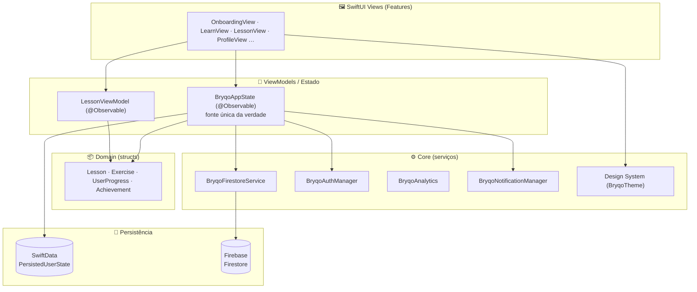

### Decisões arquiteturais

- **Estado central único (`BryqoAppState`)** — coordena SwiftData ↔ Firestore, regras de gamificação, streak, corações e onboarding. Usa `@Observable` (Observation framework) em vez de `ObservableObject`, aproveitando a API mais recente e performática.
- **Separação de modelos por camada** — cada camada tem seu próprio tipo, com mapeamento explícito:
  - `UserProgress` (struct em memória) → estado de runtime
  - `PersistedUserState` (`@Model` SwiftData) → persistência local
  - `FirestoreUserSnapshot` (DTO) → nuvem
- **ViewModels isolados** — lógica de fluxo (ex.: `LessonViewModel`) fora das Views, o que a torna testável de forma unitária.
- **Organização por feature** — `Features/<Tela>/` mantém cada tela e seus componentes coesos.
- **Concorrência moderna** — `async/await` para I/O, `@MainActor` para atualização de UI, isolamento controlado no `BryqoAuthManager`.

---

## 🎨 Design System

Todo o visual é centralizado em [`BryqoTheme`](bryco-app/Core/DesignSystem/BryqoTheme.swift), garantindo consistência e suporte nativo a light/dark.

### Tokens

| Token | Exemplos |
|---|---|
| **Cores adaptativas** | `background`, `surface`, `primary` (verde), `river` (azul), `sun` (XP), `coral` (streak) — cada uma com variante *light* e *dark* via `Color(light:dark:)` |
| **Espaçamento** | `Spacing.xs … xxxl` (4 → 40 pt) |
| **Raio** | `Radius.card` (20) · `Radius.button` (18) · `Radius.pill` |

### Componentes reutilizáveis

| Componente | Descrição |
|---|---|
| `BryqoPrimaryButton` + `Duo3DButtonStyle` | Botão 3D estilo Duolingo que "afunda" ao ser pressionado |
| `BryqoCard` / `.bryqoCard()` | Cartão padrão com borda e cantos contínuos |
| `BryqoStatPill` | Pílula de estatística (XP, streak…) |
| `BrixAvatar` / `BrixSpeechBubble` | Mascote Brix com balão de fala estilo iMessage (via `Shape` customizado) |
| `FloatingTabBar` | Barra de navegação flutuante com `matchedGeometryEffect` |
| `.bryqoFont(_:relativeTo:…)` | Fonte de tamanho fixo que **escala com Dynamic Type** (`@ScaledMetric`) |

---

## 💾 Persistência & sincronização

O Bryqo é **offline-first**: todo o progresso funciona sem rede via SwiftData, e a nuvem é uma camada de backup/sync opcional.

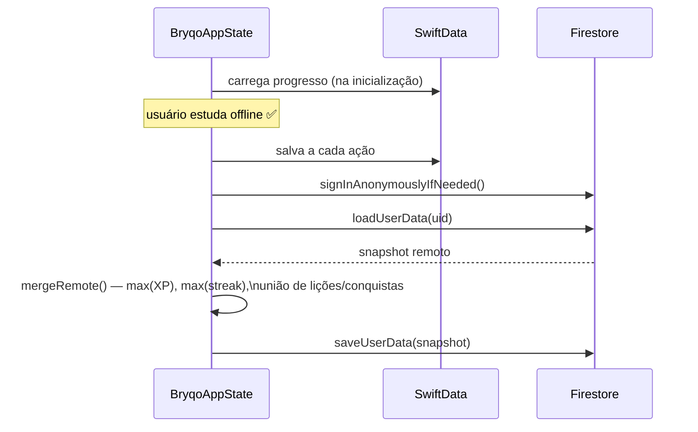

- **Migração de schema versionada** — [`PersistedUserState`](bryco-app/Domain/Models/PersistedUserState.swift) evolui por 4 versões (`BryqoSchemaV1…V4`) com um `SchemaMigrationPlan` de estágios *lightweight*.
- **Merge inteligente** — na sincronização, campos numéricos usam `max()` e coleções usam união de conjuntos, evitando perda de progresso entre dispositivos.
- **Sem bloqueio de rede** — se o login falhar, o app continua 100% funcional com os dados locais.

---

## 🎮 Gamificação

| Sistema | Regra |
|---|---|
| **XP & níveis** | Limiares `[0, 100, 250, 500, 1000, …]`; nomes por nível: Aprendiz → Estudante → Desenvolvedor → Arquiteto → Engenheiro |
| **Corações (vidas)** | Máximo de 5; erro consome 1; **regenera +1 a cada 30 min**; lição perfeita devolve 1 |
| **Sequência (streak)** | +1 por dia consecutivo; marcos em 7/30/100 dias; **streak freeze** protege 1 dia perdido automaticamente |
| **Conquistas** | 10 conquistas (comum · rara · épica) por lições, XP, streak e perfeição |
| **Meta diária** | Casual (15 XP) · Regular (30) · Sério (50) · Intenso (75) |

> A lógica dessas regras vive em [`BryqoAppState`](bryco-app/App/BryqoAppState.swift) e é coberta por testes unitários isolados.

---

## ♿ Acessibilidade

O app foi auditado contra as **Human Interface Guidelines** da Apple, com foco em acessibilidade:

- **Dynamic Type** — todo texto escala com a preferência do usuário via o modifier `.bryqoFont` (`@ScaledMetric`), preservando o design no tamanho padrão.
- **Áreas de toque de 44 pt** — mínimo estrito do HIG em botões de ícone.
- **VoiceOver** — rótulos em botões de ícone e imagens; corações anunciados como "Vidas: N de 5"; imagens decorativas ocultas.
- **Reduce Motion** — animações perpétuas (confete, mascote flutuante, cena do vale) são desativadas quando o usuário pede menos movimento.
- **Háptica** — `.sensoryFeedback` em acertos, erros, conclusão de lição e marcos de sequência.
- **Diferenciação sem cor** — estados de certo/errado sempre pareiam cor com ícone (`checkmark`/`xmark`) e texto.

---

## 🧪 Testes

**52 testes** escritos com **Swift Testing** (`@Test` / `@Suite`), cobrindo a lógica central:

| Suite | Cobre |
|---|---|
| `LessonViewModelTests` | Seleção, verificação (certo/errado), corações, XP, ordenação e progressão de passos |
| `BryqoAppStateTests` | Streak (incremento/decay/freeze), regeneração de corações, merge Firestore, níveis e meta de XP |
| `OnboardingFlowTests` | Resultado do onboarding, fallback de nome, reset e tier da meta diária |
| `ProfileStatsTests` | Nomes de nível, limiares de XP, contagem de lições e streak em risco |

> Os testes usam um *seam* de container **in-memory** (`BryqoAppState(inMemory:)`), garantindo isolamento total (princípios FIRST) — cada caso parte de um estado limpo.

```bash
# rodar os testes
xcodebuild test \
  -project bryco-app.xcodeproj \
  -scheme bryco-app \
  -destination 'platform=iOS Simulator,name=iPhone 17 Pro' \
  -only-testing:bryco-appTests
```

---

## 📁 Estrutura de pastas

```
bryco-app/
├── App/                    # Ponto de entrada, ContentView, MainTabView, BryqoAppState
├── Core/
│   ├── DesignSystem/       # BryqoTheme, ScaledFont (Dynamic Type)
│   ├── Firebase/           # Auth, Firestore, Analytics
│   └── Notifications/      # Lembrete diário local
├── Domain/
│   └── Models/             # Lesson, Exercise, UserProgress, PersistedUserState (@Model)
├── Features/               # Uma pasta por tela
│   ├── Onboarding/
│   ├── LearningPath/       # Trilha/mapa de lições
│   ├── Lesson/             # Motor de lições + tipos de questão
│   ├── Achievements/
│   ├── Profile/
│   ├── Backpack/  Valley/  Progress/  Review/
└── Resources/
    └── Content/            # BryqoContent — 12 unidades, 41 lições
bryco-appTests/             # Suites Swift Testing
docs/screenshots/           # Capturas light & dark
```

---

## 🚀 Como rodar

### Pré-requisitos
- macOS com **Xcode 26+**
- Simulador ou dispositivo com **iOS 26.5+**
- Uma conta Firebase (para os recursos de nuvem)

### Passos

```bash
# 1. Clonar
git clone <url-do-repositorio>
cd bryco-app

# 2. Abrir no Xcode (as dependências SPM resolvem automaticamente)
open bryco-app.xcodeproj
```

3. **Configurar o Firebase**: adicione seu próprio `GoogleService-Info.plist` em `bryco-app/` (Firebase Console → adicionar app iOS). Habilite **Authentication** (Anônimo + Apple) e **Firestore**.
4. Selecione o scheme **bryco-app** e um simulador, e rode com **⌘R**.

> Sem o Firebase configurado, o app ainda funciona **offline** (SwiftData) — apenas a sincronização em nuvem fica indisponível.

---

## 🗺 Roadmap

- [ ] Extrair `OnboardingViewModel` para testar a navegação do wizard
- [ ] Testes de UI de acessibilidade (XCUITest validando rótulos VoiceOver)
- [ ] Sincronização em tempo real (listeners Firestore)
- [ ] Widget de sequência (WidgetKit)
- [ ] Modo revisão espaçada (spaced repetition)

---

## 👩‍💻 Autoria

Desenvolvido por **Jenniffer Martins**.

Mascote **Brix** 🦫 e identidade visual **Bryqo** — construindo fundamentos, um bloco por vez.
